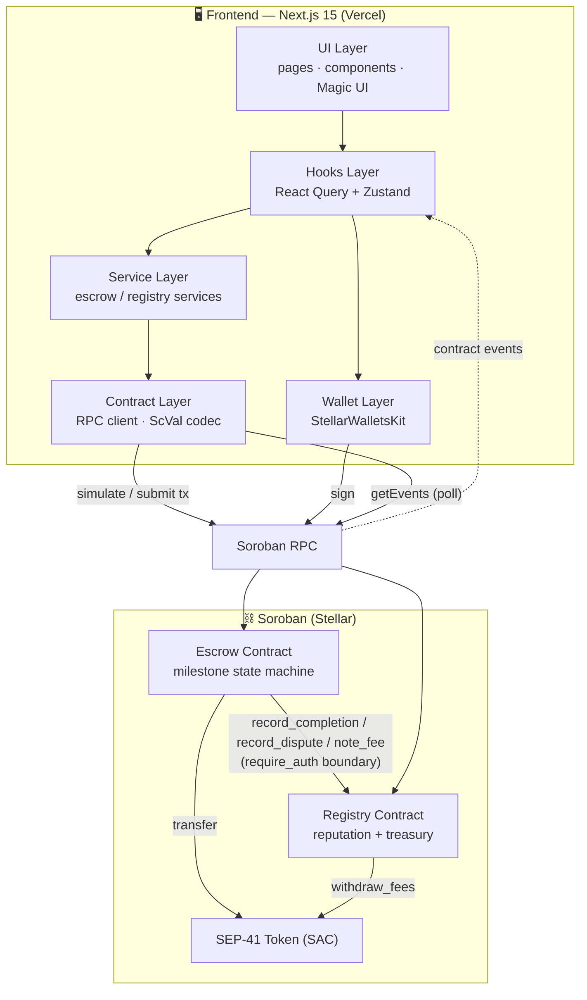
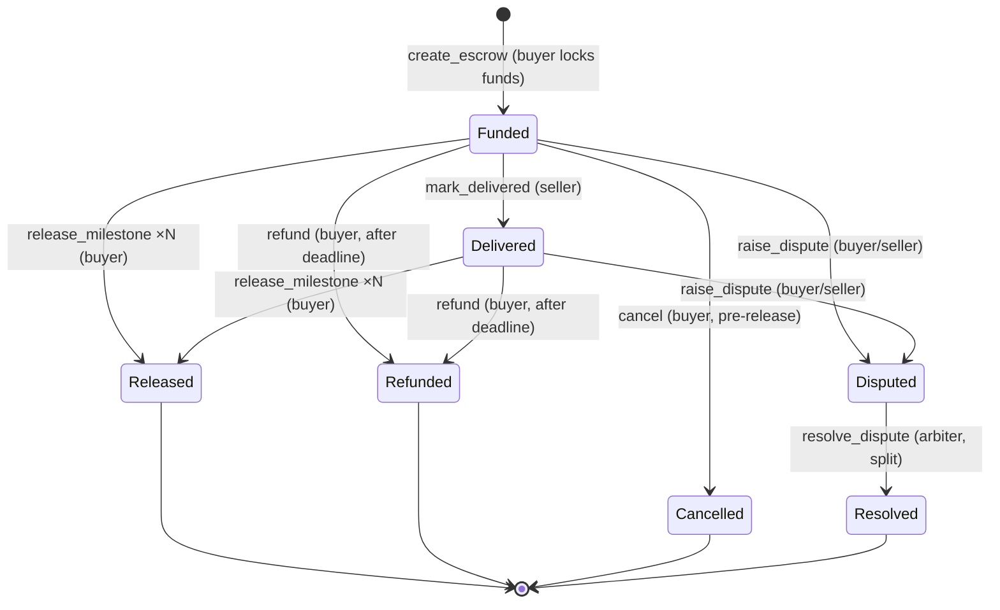
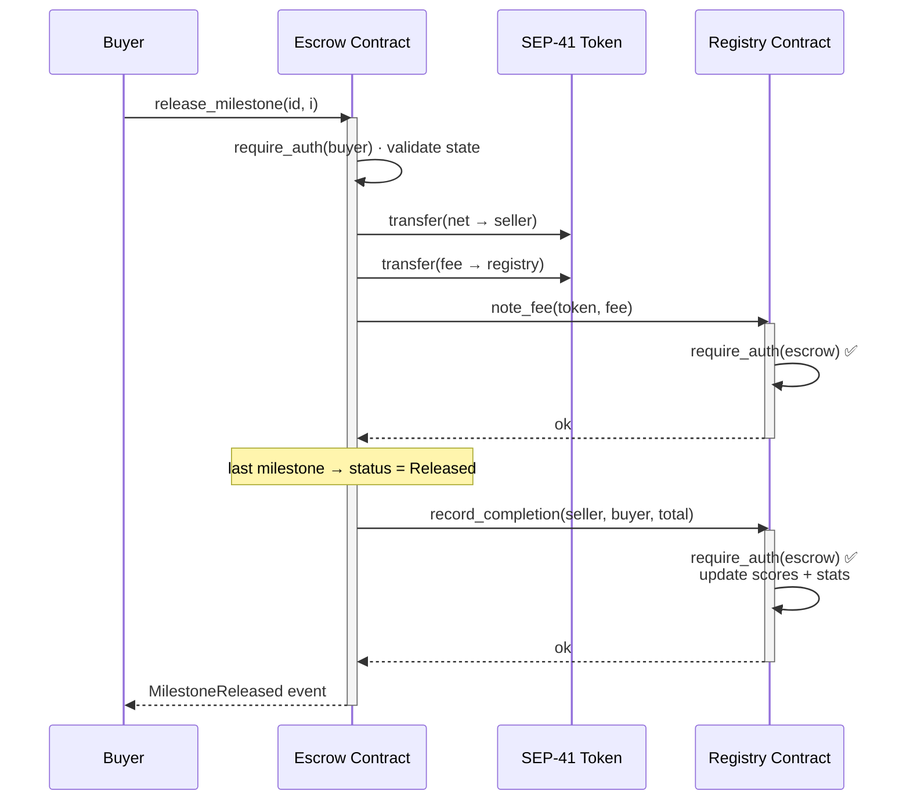

<div align="center">

# 🛡️ Aegis — Decentralized Escrow Marketplace

**Trustless, milestone-based escrow for two-sided marketplaces, built on Stellar + Soroban.**

Lock buyer funds in a smart contract, release them as work is delivered, and settle disputes with a neutral arbiter — with tamper-proof on-chain reputation and a real-time, event-driven UI.

[](.github/workflows/pr.yml)
[](https://developers.stellar.org)
[](https://nextjs.org)
[](LICENSE)

[Live demo](#-live-demo) · [Demo video](#-demo-video) · [Architecture](#-architecture) · [Local dev](#-local-development) · [Deploy](#-deployment)

</div>

---

## 📌 Product Overview

### The problem

Online marketplaces for freelance work, digital goods and services run on **trust you have to buy**:

- **Buyers** pay upfront and hope the work arrives — with no recourse but a chargeback.
- **Sellers** deliver first and hope they get paid — exposed to fraud and reversals.
- **Platforms** insert themselves as the trusted middleman, taking large fees and controlling funds, reputation and dispute outcomes opaquely.

### The solution

**Aegis** replaces the trusted middleman with two cooperating Soroban smart contracts:

- Buyer funds are **locked on-chain** the moment a deal is created.
- Funds are released **milestone by milestone**, only by the buyer, net of a transparent protocol fee.
- A neutral **arbiter** can split escrowed funds fairly if a deal is disputed.
- Every settled deal and dispute updates an **on-chain reputation** score that nobody can fake or erase.
- The treasury and reputation live in a **separate registry contract** that only the escrow contract may write to.

The result is a portfolio-grade dApp that behaves like a real startup product: production frontend architecture, real-time events, full transaction lifecycle handling, CI/CD, tests and deployment automation.

---

## 🔗 Contract Addresses

> Live on **Stellar Testnet** (deployed `2026-06-30` via `scripts/deploy_testnet.sh`; recorded in `deployments/testnet.json`).

| Contract | Network | Address |
| --- | --- | --- |
| Escrow (core) | Testnet | [`CDCMC3RTUTX3P7WV2JQI64VSBRSH777RWYTQKPXYP3CLGFCPQNXLCAEN`](https://stellar.expert/explorer/testnet/contract/CDCMC3RTUTX3P7WV2JQI64VSBRSH777RWYTQKPXYP3CLGFCPQNXLCAEN) |
| Registry (reputation + treasury) | Testnet | [`CBAEFKKISEH5TECLSHAIN22MM4K2XFJHITPLPEWS4NYXXAUED3XAGYI2`](https://stellar.expert/explorer/testnet/contract/CBAEFKKISEH5TECLSHAIN22MM4K2XFJHITPLPEWS4NYXXAUED3XAGYI2) |

**Admin / deployer:** `GASKH36HRSMRLQ2JTBJQYGPUO7TNNWUXJPVTNOUE3DTYSSSCYAFV5VEJ`
**Settlement token (native XLM SAC):** `CDLZFC3SYJYDZT7K67VZ75HPJVIEUVNIXF47ZG2FB2RMQQVU2HHGCYSC`

### Transaction Hashes

| Action | Hash |
| --- | --- |
| Escrow deploy | [`f51d50e4…b5c6af22`](https://stellar.expert/explorer/testnet/tx/f51d50e4ea2f7c9f76713246e640d3b8d1e1e0eaebf63049b1bf03d0b5c6af22) |
| Escrow `initialize` | [`9bcabef8…59bfe88e0`](https://stellar.expert/explorer/testnet/tx/9bcabef848209f08734fe6f2bfe12c343452575b020201d2ab0fdc859bfe88e0) |
| Registry `initialize` | [`1f243864…f5015a93`](https://stellar.expert/explorer/testnet/tx/1f2438641ac24a07dcaee65ebc3b2916df2602138b7f359225b64af0f5015a93) |
| Registry `set_escrow` (wiring) | [`af1af6ad…1fe8fde4`](https://stellar.expert/explorer/testnet/tx/af1af6adbd07862d41efb2696ad3f99c9ed860109b7c154b22509c451fe8fde4) |

## 🎬 Demo Video

`DEMO_VIDEO_LINK_PLACEHOLDER`

## 🌐 Live Demo

`LIVE_DEMO_PLACEHOLDER`

---

## 🏛️ Architecture



The frontend never puts blockchain logic in components — calls flow **UI → hooks → services → contract/RPC layer**, exactly the layering the Stellar docs recommend.

---

## 📜 Smart Contract Design

Two contracts in a single Cargo workspace (`contracts/`), built with `soroban-sdk` 23 and the Stellar CLI.

### Escrow contract (`contracts/contracts/escrow`) — core business logic

Custom storage, role-based access control, validation and an explicit state machine.



| Concern | Implementation |
| --- | --- |
| **Custom storage** | `DataKey` enum; instance storage for config/counters, persistent storage (with TTL bumping) for escrows & user indexes |
| **Access control** | `require_auth()` on buyer/seller/arbiter per action; admin-gated config |
| **Ownership** | `Admin` key; `set_admin`, `set_fee`, `set_registry` |
| **Role-based permissions** | buyer releases/cancels/refunds, seller delivers, arbiter resolves |
| **Validation** | positive amounts, non-empty milestones, future deadline, distinct buyer/seller, fee ≤ 10%, split ≤ 100% |
| **State transitions** | enforced `EscrowStatus` machine (see above) |
| **Upgrade strategy** | `upgrade(new_wasm_hash)` via `update_current_contract_wasm`, admin-only, storage preserved |
| **Events** | typed `#[contractevent]` structs (`EscrowCreated`, `MilestoneReleased`, `Disputed`, `Resolved`, …) |

### Registry contract (`contracts/contracts/registry`) — reputation + treasury

| Concern | Implementation |
| --- | --- |
| **Reputation ledger** | per-account `Reputation` with derived 0–1000 trust score (`compute_score`) |
| **Treasury** | per-token fee accounting; admin-only `withdraw_fees` |
| **Permission boundary** | mutations require `escrow.require_auth()` — only the registered escrow contract may write |
| **Stats** | marketplace-wide completed / volume / disputes counters |
| **Upgrade** | admin-only `upgrade(new_wasm_hash)` |

---

## 🔁 Inter-Contract Communication Flow

When an escrow fully releases, the escrow contract calls into the registry to bank the fee and update both parties' reputation. The registry authorizes the call by requiring the escrow contract's own authorization — a boundary only the registered escrow can satisfy.



The escrow declares the registry interface with `#[contractclient]` (`registry_client.rs`) instead of linking the registry crate, avoiding WASM symbol collisions while keeping the call **fully type-safe**.

---

## ✨ Features

- **Milestone escrow** — lock once, release in parts, with live progress.
- **On-chain reputation** — trust scores that update on every settlement and dispute.
- **Dispute resolution** — arbiter splits funds by basis points.
- **Real-time event streaming** — `getEvents` poll loop → live activity feed, toasts and auto-refreshing data, no page reloads.
- **Full transaction lifecycle** — pending → processing → confirmed/failed, with hash, explorer link, timestamp, contract and **retry**.
- **Multi-wallet** — Freighter, xBull, Albedo, Lobstr, Hana, Rabet, Ledger… via StellarWalletsKit, with connect/disconnect, session persistence, account & network switching, and human-readable error handling.
- **Six pages** — Landing, Dashboard, Activity Feed, Transaction Center, Analytics, Settings.
- **Mobile-first** — responsive layouts, slide-over mobile nav, adaptive tables (table ↔ cards), touch-friendly controls.
- **Observability** — structured logger, pluggable error-tracking sink, transaction & event monitoring.
- **Polished UI** — shadcn/ui + Magic UI (animated beams, bento grid, number tickers, shimmer buttons, border beams) on an orange "Stellar Belt" theme with dark mode.

---

## 🧰 Tech Stack

| Layer | Tech |
| --- | --- |
| Smart contracts | Rust, `soroban-sdk` 23, Stellar CLI 26 (`wasm32v1-none`) |
| Frontend | Next.js 15 (App Router), React 19, TypeScript |
| Styling/UI | Tailwind CSS, shadcn/ui, Magic UI, Framer Motion, lucide-react |
| Data/state | TanStack React Query, Zustand |
| Stellar SDK | `@stellar/stellar-sdk` (RPC, XDR), `@creit.tech/stellar-wallets-kit` |
| Forms | react-hook-form + Zod |
| Testing | Cargo tests, Vitest, React Testing Library |
| CI/CD | GitHub Actions → Vercel |

---

## 🗂️ Project Structure

```
.
├── contracts/                      # Soroban Cargo workspace
│   ├── Cargo.toml                  # workspace + release profile
│   └── contracts/
│       ├── escrow/                 # core contract (lib, types, events, registry_client, tests)
│       └── registry/               # reputation + treasury (lib, types, events, tests)
├── web/                            # Next.js 15 frontend
│   └── src/
│       ├── app/                    # routes: landing + (app) group (dashboard, activity, …)
│       ├── components/             # ui/ (shadcn) · magicui/ · feature components
│       ├── hooks/                  # React Query + write orchestration
│       ├── lib/                    # stellar/ (config, client, wallet, contracts, events, scval)
│       │                           #  logger, errors, format, activity-format
│       ├── stores/                 # Zustand: wallet, tx, activity, settings
│       └── types/                  # domain types
├── scripts/                        # deploy_local/testnet, init, upgrade, gen_bindings
├── deployments/                    # auto-written deployment metadata (gitignored)
├── docs/                           # DEPLOYMENT.md · SECURITY.md
└── .github/workflows/              # pr.yml · deploy.yml
```

---

## 💻 Local Development

### Prerequisites

```bash
# Rust + WASM target
rustup target add wasm32v1-none
# Stellar CLI (https://developers.stellar.org/docs/tools/cli)
cargo install --locked stellar-cli
# Node 20+
node --version
```

### 1. Contracts

```bash
cd contracts
cargo test            # run all contract + integration tests
stellar contract build  # compile to target/wasm32v1-none/release/*.wasm
```

### 2. Deploy to testnet (writes ids into deployments/ and prints env vars)

```bash
./scripts/deploy_testnet.sh
```

### 3. Frontend

```bash
cd web
cp .env.example .env.local     # paste the contract ids printed by the deploy script
npm install
npm run dev                    # http://localhost:3000
```

---

## 🔐 Environment Variables

All client config is public by design — **no secrets in the frontend**. See `web/.env.example`.

| Variable | Description | Example |
| --- | --- | --- |
| `NEXT_PUBLIC_STELLAR_NETWORK` | `testnet` \| `local` \| `mainnet` | `testnet` |
| `NEXT_PUBLIC_SOROBAN_RPC_URL` | Soroban RPC endpoint | `https://soroban-testnet.stellar.org` |
| `NEXT_PUBLIC_NETWORK_PASSPHRASE` | Network passphrase | `Test SDF Network ; September 2015` |
| `NEXT_PUBLIC_HORIZON_URL` | Horizon endpoint | `https://horizon-testnet.stellar.org` |
| `NEXT_PUBLIC_ESCROW_CONTRACT_ID` | Deployed escrow contract id | `C…` |
| `NEXT_PUBLIC_REGISTRY_CONTRACT_ID` | Deployed registry contract id | `C…` |
| `NEXT_PUBLIC_DEFAULT_TOKEN_ID` | Default settlement token (SAC) | `C…` |
| `NEXT_PUBLIC_EXPLORER_BASE_URL` | Explorer base URL | `https://stellar.expert/explorer/testnet` |

**Deployment secrets** (GitHub Actions → repo secrets, never committed): `VERCEL_TOKEN`, `VERCEL_ORG_ID`, `VERCEL_PROJECT_ID`.

---

## 🧪 Testing

```bash
# Smart contract tests (success/failure paths, permissions, state transitions,
# inter-contract integration via the real registry contract)
cd contracts && cargo test

# Frontend unit + component tests (Vitest + RTL)
cd web && npm run test
```

- **Contracts (21 tests):** escrow lifecycle, fee math, dispute split, refund/cancel guards, access control, and escrow↔registry integration.
- **Frontend:** amount/format logic, error mapping, activity decoding, event decoding, wallet connection flow, transaction lifecycle store, and component rendering.

---

## 🤖 CI/CD

| Workflow | Trigger | Steps |
| --- | --- | --- |
| `pr.yml` | Pull request | **contracts:** fmt · clippy · `cargo test` · `stellar contract build`; **frontend:** `npm ci` · lint · typecheck · test |
| `deploy.yml` | Push to `main` | build + test frontend → deploy to Vercel (`vercel build/deploy --prod`) → validate deployment (HTTP 200 health check) |

---

## 🚀 Deployment

Full walkthrough in [`docs/DEPLOYMENT.md`](docs/DEPLOYMENT.md). In short:

```bash
./scripts/deploy_testnet.sh      # build, deploy both contracts, init + wire registry, write metadata
./scripts/gen_bindings.sh testnet  # (optional) regenerate typed TS bindings
./scripts/upgrade_contract.sh escrow testnet   # upgrade flow (upload wasm → upgrade())
```

Deployment metadata (ids, wasm hashes, tx hashes, timestamp) is written to `deployments/<network>.json` automatically.

---

## 🛡️ Security Considerations

Details in [`docs/SECURITY.md`](docs/SECURITY.md).

- **Input validation** on-chain (amounts, milestones, deadlines, fee/split bounds) and off-chain (Zod + address checks).
- **Role-based access control** via `require_auth()`; the escrow↔registry **permission boundary** ensures only the registered escrow can mutate reputation/treasury.
- **Transaction verification** — every write is simulated (`prepareTransaction`) before signing and polled to confirmation.
- **No secrets in the client** — only public RPC/contract config; deploy keys live in CI secrets.
- **Upgrade authority** is admin-gated; manage the admin key as a multisig/hardware key in production.
- **Fee bounds** capped at 10%; dispute splits bounded to 0–100%.

---

## 📱 Screenshots

> Capture from `npm run dev` (the app is fully responsive — mobile, tablet, desktop).

| Landing | Dashboard | Activity Feed |
| --- | --- | --- |
| _add screenshot_ | _add screenshot_ | _add screenshot_ |

| Transaction Center | Analytics | Mobile |
| --- | --- | --- |
| _add screenshot_ | _add screenshot_ | _add screenshot_ |

---

## 🧱 Commit History Plan

A realistic, reviewable history (each a focused PR):

1. `chore: project scaffolding (workspace, tooling, CI skeleton)`
2. `feat(contracts): registry contract — reputation + treasury`
3. `feat(contracts): escrow core — milestone state machine`
4. `feat(contracts): inter-contract calls + permission boundary`
5. `test(contracts): lifecycle, access control & integration tests`
6. `feat(web): app scaffold, theme, stellar config & RPC client`
7. `feat(web): StellarWalletsKit wallet infrastructure`
8. `feat(web): contract service + hooks layer (React Query)`
9. `feat(web): real-time event streaming + activity feed`
10. `feat(web): transaction lifecycle center with retry`
11. `feat(web): dashboard, analytics, settings pages`
12. `feat(web): landing page with Magic UI`
13. `test(web): unit + component tests (Vitest/RTL)`
14. `ci: PR + Vercel deploy workflows`
15. `feat(scripts): deployment, init, upgrade & bindings automation`
16. `docs: README, architecture diagrams, deployment & security guides`

---

## 📄 License

MIT © Aegis Labs
# THIRD-BELT

